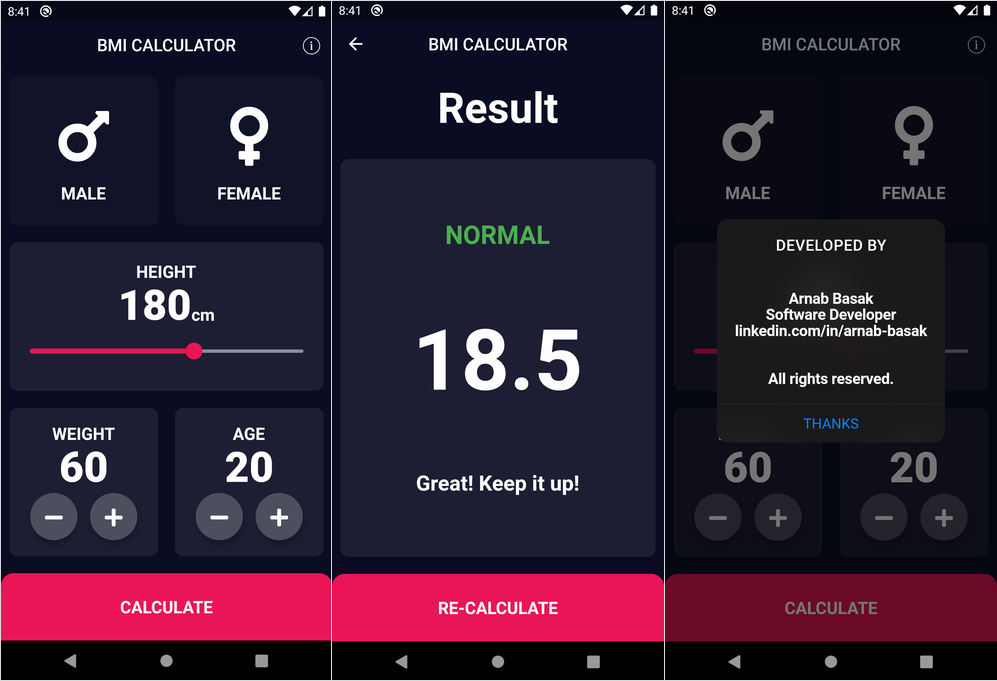

# 
BMI Calculator

## :clipboard: Features
BMI - an application to calculate **Body Mass Index (BMI)**. The application build for both Android and iOS using a single codebase, ***Flutter***.

Features available:

- [x] Interactive UI
- [x] Smooth Slider
- [x] Interaction Button
- [x] Accurate BMI Result 
- [x] Advice Messages
- [ ] Create an User Profile
- [ ] Store BMI History

## :gear: Prerequisites
* Flutter
* Dart
* IDE (*one from below*)
    * Android Studio (*Recommend*)
    * Visual Studio Code
    * Xcode (*Mac*)

## :envelope_with_arrow: Install
* Flutter : [Flutter](https://flutter.dev/)
* Android Studio : [Android Studio](https://developer.android.com/studio/?gclsrc=ds&gclsrc=ds)
* Visual Studio Code : [Visual Studio Code](https://code.visualstudio.com/)

## :hammer: APK

Released application (***APK file***) can be found here... [BMI](https://github.com/arnabb38/bmi_calculator)

## :bust_in_silhouette: Author
### Arnab Basak
- [x] Linkedin: [@arnab-basak](https://linkedin.com/in/arnab-basak)
- [x] Github: [@arnabb38](https://github.com/arnabb38)

## :v: Show your support
Follow me on :octocat: [Github](https://github.com/arnabb38) if that project helped you.

## :handshake: Contributing
Contributions, issues and feature requests are welcome.
Feel free to check issues page to send your request message if you want to contribute, private use, reuse the code or distribute.

## :memo: License
Copyright © 2020 [Arnab Basak](https://github.com/arnabb38). All rights reserved. 
